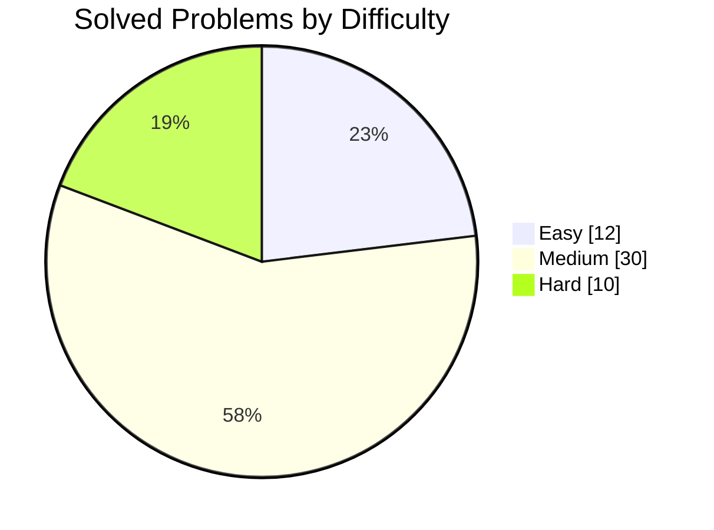
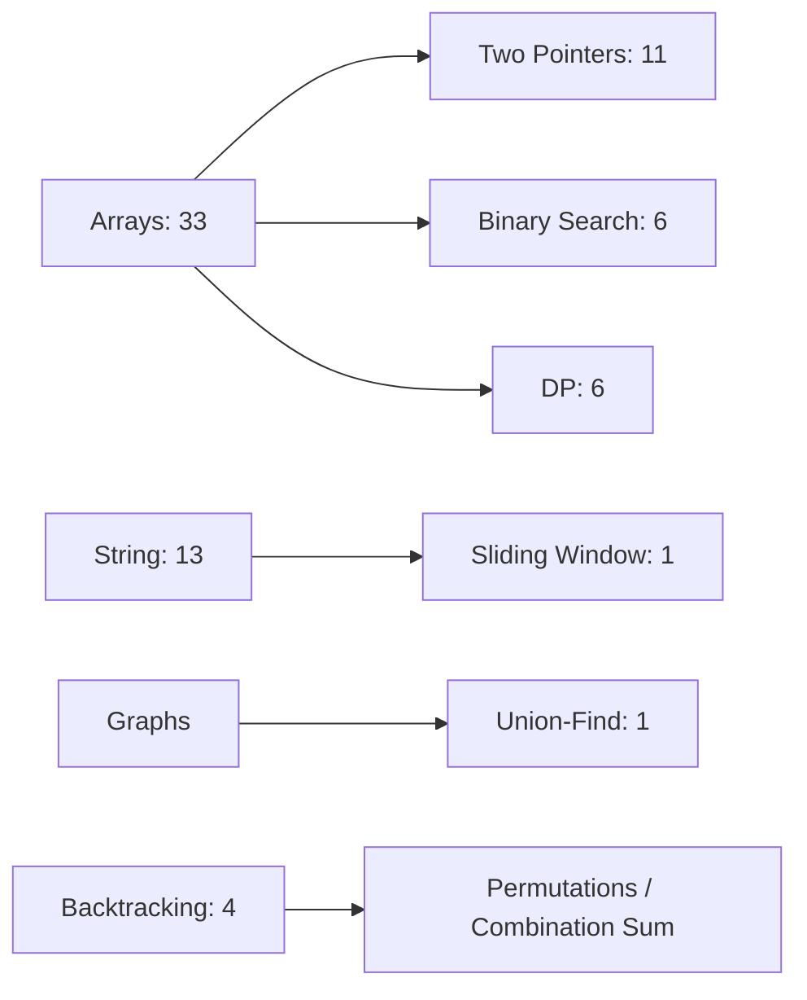

<p align="center">
  
</p>

<p align="center">
  <a href="https://leetcode.com/u/manikantbindass/"></a>
  
  
  
</p>

## Mission

This repository tracks my FAANG-level DSA preparation with Java implementations, pattern notes, and LeetCode progress from [`manikantbindass`](https://leetcode.com/u/manikantbindass/). The goal is simple: build strong recall, clean implementation habits, and interview-ready problem patterns.

## Progress Dashboard

Last synced: 2026-04-22, Asia/Calcutta

| Metric | Progress |
|---|---:|
| Total solved | 52 |
| Goal progress | 52 / 300, 17.3% |
| Easy | 12 solved |
| Medium | 30 solved |
| Hard | 10 solved |
| Failed attempts still open | 2 Hard |
| Global rank | 2,457,782 |






## Repository Map

```text
DSA-Preparation-FAANG-/
|-- Arrays/         Core array, two-pointer, prefix, cyclic placement
|-- Backtracking/   Permutations and combination search
|-- BinarySearch/   Classic sorted-search templates
|-- DP/             Grid DP and stock-state DP
|-- Graphs/         Union-Find and graph traversal patterns
|-- Intervals/      Merge and insert interval patterns
|-- Matrix/         Matrix traversal and in-place marking
|-- Stack/          Monotonic stack problems
|-- Strings/        Sliding window and formatting
|-- Trees/          Tree practice area
|-- Notes/          Pattern notes and cheat sheets
`-- Manikant-DSA-FAANG-Prep/  Daily logs and extra practice structure
```

## Topic Summaries

### Dynamic Programming

DP is about turning repeated choices into stored state. The important skill is defining what one state means before writing loops.

| Pattern | What to Remember | Example in Repo |
|---|---|---|
| Grid DP | Current cell depends on top/left or neighboring states | [MinimumPathSum.java](DP/MinimumPathSum.java) |
| Buy/Sell State DP | Track hold/sell states after each transaction | [BestTimeToBuyAndSellStockIII.java](DP/BestTimeToBuyAndSellStockIII.java) |
| 1D Optimization | Compress rows when only previous state is needed | Practice target |
| Subsequence DP | Compare include/exclude or matching characters | Practice target |
| Knapsack DP | Choose item or skip item under capacity | Practice target |

### Trees

Tree problems usually become clear after choosing the traversal and deciding what each recursive call returns.

| Pattern | What to Remember | Status |
|---|---|---|
| DFS Recursion | Return height, sum, validity, or best path from subtree | Practice target |
| BFS Level Order | Queue-based level processing for shortest depth and views | Practice target |
| BST Invariant | Left subtree smaller, right subtree larger | Practice target |
| LCA | Use recursion to bubble up matching nodes | Practice target |
| Serialization | Preserve structure with null markers or level order | Practice target |

### Graphs

Graph questions are about modeling relationships, then picking traversal or connectivity tools.

| Pattern | What to Remember | Example in Repo |
|---|---|---|
| Union-Find | Fast component merging and lookup | [MinimizeHammingDistanceAfterSwapOperations.java](Graphs/MinimizeHammingDistanceAfterSwapOperations.java) |
| BFS | Shortest path in unweighted graphs | Practice target |
| DFS | Connected components, cycle detection, flood fill | Practice target |
| Topological Sort | Directed dependency order with indegrees or DFS states | Practice target |
| Dijkstra | Weighted shortest path with priority queue | Practice target |

## Recently Added LeetCode Solutions

These solution files cover the latest public accepted submissions exposed by LeetCode for the profile. LeetCode publicly exposes the latest accepted submissions, while the profile count confirms 52 total solved problems.

| Problem | Topic Folder | Solution |
|---|---|---|
| Minimize Hamming Distance After Swap Operations | Graphs | [Java](Graphs/MinimizeHammingDistanceAfterSwapOperations.java) |
| Spiral Matrix II | Matrix | [Java](Matrix/SpiralMatrixII.java) |
| Insert Interval | Intervals | [Java](Intervals/InsertInterval.java) |
| Merge Intervals | Intervals | [Java](Intervals/MergeIntervals.java) |
| Search a 2D Matrix | Matrix | [Java](Matrix/SearchA2DMatrix.java) |
| Text Justification | Strings | [Java](Strings/TextJustification.java) |
| Plus One | Arrays | [Java](Arrays/PlusOne.java) |
| Permutations II | Backtracking | [Java](Backtracking/PermutationsII.java) |
| Permutations | Backtracking | [Java](Backtracking/Permutations.java) |
| Remove Duplicates from Sorted Array II | Arrays | [Java](Arrays/RemoveDuplicatesFromSortedArrayII.java) |
| First Missing Positive | Arrays | [Java](Arrays/FirstMissingPositive.java) |
| Search in Rotated Sorted Array II | BinarySearch | [Java](BinarySearch/SearchInRotatedSortedArrayII.java) |
| 4Sum | Arrays | [Java](Arrays/FourSum.java) |
| Largest Rectangle in Histogram | Stack | [Java](Stack/LargestRectangleInHistogram.java) |
| Set Matrix Zeroes | Matrix | [Java](Matrix/SetMatrixZeroes.java) |
| Find First and Last Position of Element in Sorted Array | BinarySearch | [Java](BinarySearch/FindFirstAndLastPositionOfElementInSortedArray.java) |
| Combination Sum | Backtracking | [Java](Backtracking/CombinationSum.java) |
| Best Time to Buy and Sell Stock III | DP | [Java](DP/BestTimeToBuyAndSellStockIII.java) |
| Merge Sorted Array | Arrays | [Java](Arrays/MergeSortedArray.java) |
| Minimum Path Sum | DP | [Java](DP/MinimumPathSum.java) |

## LeetCode Stats

| Difficulty | Solved | Total LeetCode Questions | Platform Coverage |
|---|---:|---:|---:|
| Easy | 12 | 938 | 1.3% |
| Medium | 30 | 2,044 | 1.5% |
| Hard | 10 | 924 | 1.1% |
| All | 52 | 3,906 | 1.3% |

| Language | Problems Solved |
|---|---:|
| Java | 45 |
| Go | 6 |
| C++ | 1 |

## Topic Coverage From LeetCode Tags

| Topic | Problems Solved | Topic | Problems Solved |
|---|---:|---|---:|
| Array | 33 | String | 13 |
| Two Pointers | 11 | Math | 8 |
| Hash Table | 7 | Sorting | 7 |
| Binary Search | 6 | Dynamic Programming | 6 |
| Linked List | 5 | Recursion | 5 |
| Matrix | 5 | Stack | 4 |
| Backtracking | 4 | Simulation | 3 |
| Divide and Conquer | 2 | Monotonic Stack | 2 |
| Trie | 1 | Union-Find | 1 |
| Greedy | 1 | Depth-First Search | 1 |
| Sliding Window | 1 | Bit Manipulation | 1 |

## Pattern Checklist

| Pattern | Use Case | Current Focus |
|---|---|---|
| Sliding Window | Contiguous subarrays and substrings in O(n) | Strings |
| Two Pointers | Sorted arrays, pairs, triplets, partitioning | Arrays |
| Binary Search | Search-space reduction in O(log n) | Rotated arrays |
| Monotonic Stack | Next smaller/greater and histogram area | Stack |
| Backtracking | Permutations, subsets, combinations | Search trees |
| Union-Find | Connected components and swappable groups | Graphs |
| Dynamic Programming | Reused subproblems and state transitions | Grid and stock DP |

## Resources

- [NeetCode.io](https://neetcode.io)
- [Striver's A2Z DSA Course](https://takeuforward.org/strivers-a2z-dsa-course/)
- [LeetCode](https://leetcode.com)
- [GeeksforGeeks](https://www.geeksforgeeks.org/)

<p align="center">
  
</p>
